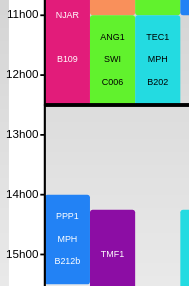

### Parameters:
- groups :
- start_time: 
- end_time:
- lunch_length : 

### Description
This constraint ensures that groups {groups} have a break for lunch (or anything else) of at least twenty minutes between 
{start_time} and {end_time} on {week_days}

### Example : 
- groups = All
- start_time = 12h30
- end_time = 14h
- lunch_length = 60 minutes

Ok:, Pas ok : 